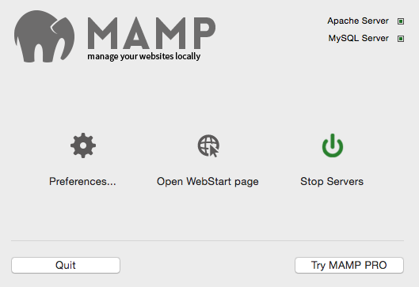
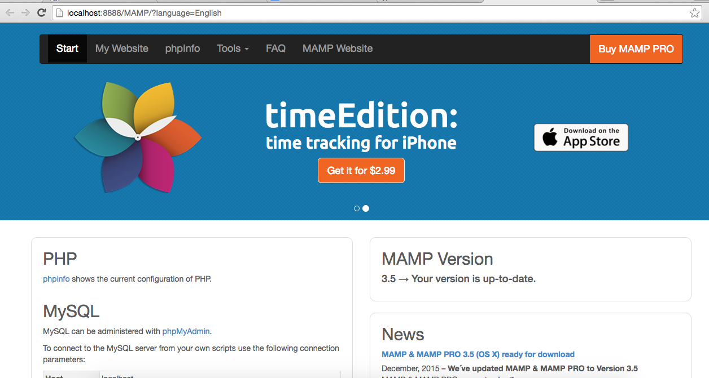
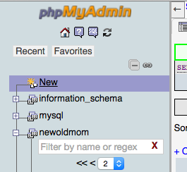
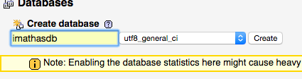
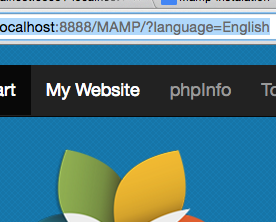
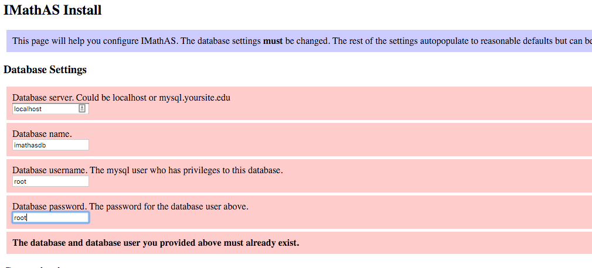
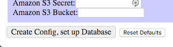
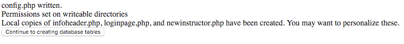
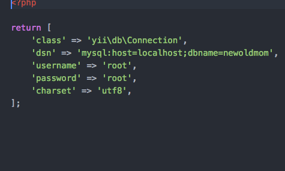
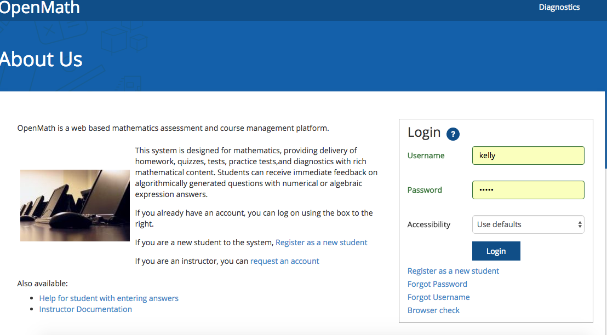

## Getting Started

These instructions will get you a copy of the project up and running on your local machine for development and testing purposes.

### Prerequisities

```
Mamp (installation process follows)
```

### Installing

```
1) Download Mamp (https://www.mamp.info/en/downloads/)

```


```
2) Clone the https://github.com/lumenlearning/IMathAS onto your desktop (Or any other folder) using your command-line program (such as Terminal using a Mac) 

3) Switch to branch “old_mom_master” ($ git checkout old_mom_master)

```
```
3) Open Mamp and Start Servers
```
```
4) This should popup a window on your browser that looks like:  (If this doesn't happen just click on the “Open Web Start Page” Button on the Mamp Homepage)

```


```
5) Click on Tools On the Mamp open page and then click PhpMyAdmin from the dropdown.
```
```
6) In PhpMyAdmin Click on the new button and create a new database(You can call the database whatever and for the collation dropdown select the “utf8_ general_ci”.
```
 

```
7) After Creating the new database go back to the Mamp WebStart Page and click on the My Website tab.
          * This should take you to http://localhost:8888/

```

```
8) Add install.php to the url so it looks like http://localhost:8888/install.php
```
```
9) On the install.php page
   1)  In the field “Database Name” add the name of the database you added in PhPmyadmin.
   2)  In the username and password fields add the username and password.( Which generally are root and root)

```

```
10) Then scroll to the bottom of the page and click on the “Create, config ,setup database” button.
```


```
11) This should take you to a page that looks like:
    Click on the `continue to creating database tables`
```


```
12) It will take you to page with a list of database names, you can redirect to         
    http://localhost:8888/index.php
```

```
13) Now switch to branch “development” (in your command-line program, enter $ git checkout development)
```
```
14) Copy the `config/db_example.php` to `config/db.php` and then:
     1) Change the the name of the database at the end of line 5 to the database name you made in step 6.
     2) Also change the password and username as well ( Which should be root,root ).
```


```
15) Under the web folder in the file directory add an empty folder called “assets”.
```
```
16) Restart the mamp server and open http://localhost:8888/
    This should automatically redirect you to the login page.
```


### If something breaks. Look at the Debugging Steps

### Debugging

These are tips for if anything breaks and or doesn't work.

```
* Open localhost in inprivate/Incognito
* Clear the cookies and/or opening the site using an incognito window (which clears the cookies)
* Turn on Output Buffering (Mamp php.ini)
* Delete Cookies
* Stop and restart Mamp
* Index.php (remove empty lines before the php tag)
* Ensure you have read/write permissions to the web/assets directory. This can be done by going to your command line program (such as Terminal on Mac), navigating to the root project folder, and $ sudo chmod 777 web/assets
* Change line 428 in Appcontroller.php from
    return $this->redirect('dashboard'); to
    return array('status'=>true, 'message'=>"");


```

##### Psysh Integration
 - Follow psysh installation instructions (http://psysh.org/#install)
 - In the console, type `psysh` to start a new shell prompt
 - Then copy and paste the code below in at the prompt

        require(__DIR__ . '/vendor/autoload.php');
        require(__DIR__ . '/vendor/yiisoft/yii2/Yii.php');

        $config = require(__DIR__ . '/config/web.php');
        error_reporting(E_ALL ^ E_NOTICE);
        $app = new yii\web\Application($config);
